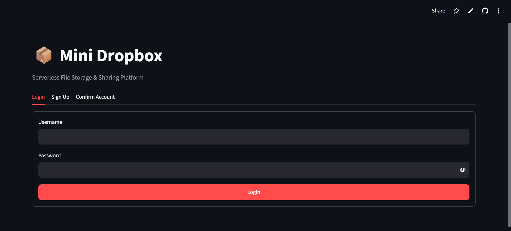

# 📦 Mini Dropbox — Serverless File Storage & Sharing Platform

A Dropbox-like cloud file storage and sharing web app built entirely on **serverless AWS infrastructure**, with a **Streamlit** frontend. Users can register/login, upload files directly to S3 via pre-signed URLs, view their files, download them, delete them, and generate temporary shareable links — with zero servers to manage on the backend, and zero hosting cost for the frontend.

**🔗 Live App:** `https://serverless-mini-dropbox-file-storage-and-sharing-platform.streamlit.app/`

---

## 🖼️ Preview

| Login | Dashboard |
|---|---|
|  |  |

> Replace the images above (and throughout this README) by adding your own screenshots to a `screenshots/` folder in the repo root. Full list in the [Screenshots](#-screenshots) section.

---

## 🚀 Features

- 🔐 **Authentication** — Sign up, email verification, and login via Amazon Cognito (JWT-based)
- 📤 **Upload** — Direct-to-S3 upload using pre-signed URLs (files never pass through a server)
- 📄 **List Files** — Per-user file listing pulled from DynamoDB
- ⬇️ **Download** — Secure, time-limited pre-signed download links
- 🔗 **Share** — Generate temporary shareable links with configurable expiry
- 🗑️ **Delete** — Removes both the S3 object and its DynamoDB metadata
- 📊 **Dashboard metrics** — Total files, real storage used, and files shared this session
- ⏳ **Post-upload sync** — Frontend polls briefly after upload so newly uploaded files appear without needing a manual refresh/logout
- 🧩 **Fully serverless backend** — No EC2, no containers, pay only per request
- ☁️ **Zero-cost, always-on frontend hosting** via Streamlit Community Cloud

---

## 🏗️ Architecture

```
┌─────────────┐        HTTPS         ┌──────────────────┐
│  Streamlit  │ ───────────────────► │  Amazon Cognito   │  (Sign up / Login)
│  Frontend   │ ◄─────────────────── │  (User Pool)      │
│ (Streamlit  │      JWT Tokens       └──────────────────┘
│  Cloud)     │
└──────┬──────┘
       │
       │  Bearer <AccessToken>
       ▼
┌─────────────────────┐
│ Amazon API Gateway    │  (HTTP API, Cognito JWT Authorizer)
│  /upload  /files        │
│  /download /file          │
│  /share                    │
└──────────┬──────────────┘
           │ invokes
           ▼
┌─────────────────────┐        ┌───────────────────┐
│   AWS Lambda           │ ─────► │  Amazon DynamoDB     │  (File metadata)
│  (5 request functions)  │        └───────────────────┘
│                           │ ─────► ┌───────────────────┐
└────────┬──────────────────┘        │   Amazon S3           │  (File storage)
         │                            └────────┬──────────┘
         │ triggered on ObjectCreated           │
         ▼                                      │
┌─────────────────────┐                         │
│ store-file-metadata    │ ◄───────────────────────┘
│  Lambda (S3 trigger)     │
│  writes metadata to      │
│  DynamoDB including       │
│  file size                 │
└─────────────────────┘
```

**Flow summary:**
1. User signs up / logs in via Cognito → receives a JWT Access Token.
2. Frontend calls API Gateway endpoints with `Authorization: Bearer <token>`.
3. API Gateway validates the JWT (Cognito JWT Authorizer) before invoking Lambda.
4. Upload: Lambda returns a pre-signed S3 PUT URL → frontend uploads the file **directly to S3**.
5. An S3 `ObjectCreated` event asynchronously triggers a separate Lambda that writes file metadata (name, size, owner, timestamp) into DynamoDB.
6. The frontend briefly polls `/files` right after upload so the new file appears as soon as that async write completes, instead of requiring a manual refresh.
7. All other operations (list/download/delete/share) read/write DynamoDB and generate pre-signed S3 URLs as needed.

---

## 🧰 Tech Stack

| Layer | Technology |
|---|---|
| Frontend | Python, Streamlit |
| Frontend Hosting | Streamlit Community Cloud (free, always-on) |
| Authentication | Amazon Cognito (User Pool + App Client) |
| API Layer | Amazon API Gateway (HTTP API) with JWT Authorizer |
| Compute | AWS Lambda (Python 3.x) |
| Storage | Amazon S3 (pre-signed URLs, no public access) |
| Database | Amazon DynamoDB (on-demand capacity) |
| IAM | Least-privilege execution roles per Lambda + scoped deploy user |

---

## ☁️ AWS Services Used

- **Amazon Cognito** — User Pool for authentication; issues JWT Access/ID/Refresh tokens.
- **AWS Lambda** — Six functions total:
  - `generate-upload-url` — creates a pre-signed S3 PUT URL
  - `list-files` — queries DynamoDB for the logged-in user's files
  - `download-file` — creates a pre-signed S3 GET URL
  - `delete-file` — deletes the S3 object + DynamoDB record
  - `share-file` — creates a time-limited pre-signed share URL
  - `store-file-metadata` — S3 event-triggered function that writes metadata (including file size) after upload
- **Amazon API Gateway (HTTP API)** — Routes requests to Lambda, secured with a Cognito JWT Authorizer.
- **Amazon S3** — Stores raw file objects under `uploads/<user_id>/<uuid>_<filename>`; CORS configured to allow `PUT`/`GET` from the deployed frontend origin.
- **Amazon DynamoDB** — Table keyed on `UserID` (partition key) + `FileID` (sort key), storing file metadata including `FileSize`.
- **IAM** — Scoped Lambda execution roles, plus a dedicated deploy-time IAM user restricted to `cognito-idp:InitiateAuth`, `SignUp`, `ConfirmSignUp` only.

**CloudFront was deliberately not used** — API Gateway and S3 pre-signed URLs already serve over HTTPS, and Streamlit Cloud provides HTTPS for the frontend. CloudFront would add cost and complexity (custom domain, CDN caching, WAF) with no benefit at this project's scale.

---

## 📁 Project Structure

### Backend (AWS Lambda functions)
```
backend/
└── lambdas/
    ├── generate-upload-url/
    │   └── lambda_function.py
    ├── list-files/
    │   └── lambda_function.py       # JSON-serializes DynamoDB Decimal types
    ├── download-file/
    │   └── lambda_function.py
    ├── delete-file/
    │   └── lambda_function.py
    ├── share-file/
    │   └── lambda_function.py
    └── store-file-metadata/
        └── lambda_function.py       # captures FileSize from the S3 event
```

### Frontend (Streamlit)
```
frontend/
├── app.py                     # Entry point — controls navigation only
├── core/
│   ├── __init__.py
│   ├── config.py                # AWS/API constants
│   ├── session.py                 # Session-state helpers (login state, tokens)
│   └── formatters.py                # Display formatting (e.g. byte sizes)
├── services/
│   ├── __init__.py
│   ├── cognito_service.py             # Login / sign up / confirm (Cognito, secrets-aware)
│   └── storage_service.py               # Upload / list / download / delete / share (API Gateway)
├── views/
│   ├── __init__.py
│   ├── login_view.py                     # Login / Sign Up / Confirm UI
│   └── dashboard_view.py                   # Metrics, upload (with post-upload sync), file list, actions
├── assets/
│   └── style.css
└── requirements.txt
```

---

## 🔌 API Reference

All endpoints require:
```
Authorization: Bearer <Cognito Access Token>
```

| Method | Endpoint | Request Body / Params | Response |
|---|---|---|---|
| `POST` | `/upload` | `{ "filename": "report.pdf" }` | `{ "uploadURL": "...", "fileKey": "..." }` — client then `PUT`s file bytes to `uploadURL` |
| `GET` | `/files` | – | `[ { "FileID", "FileName", "FileKey", "UploadTime", "FileSize", "Bucket", "UserID" } ]` |
| `GET` | `/download` | Query param: `fileId` | `{ "downloadURL": "..." }` |
| `DELETE` | `/file` | `{ "fileId": "..." }` | `{ "message": "File deleted successfully" }` |
| `POST` | `/share` | `{ "fileId": "...", "expiresIn": 3600 }` | `{ "shareURL": "...", "expiresIn": 3600 }` |

---

## ⚙️ Setup & Installation

### 1. Backend (AWS)

1. Create a **Cognito User Pool** and **App Client** (no client secret, `USER_PASSWORD_AUTH` flow enabled).
2. Create an **S3 bucket** (block all public access; enable CORS for `PUT`/`GET` from your frontend origin).
3. Create a **DynamoDB table** with partition key `UserID` (String) and sort key `FileID` (String), on-demand capacity.
4. Deploy the six Lambda functions from `backend/lambdas/`, each with an execution role scoped to only the S3 bucket / DynamoDB table it needs.
5. Set environment variables on each Lambda: `TABLE_NAME`, `BUCKET_NAME`.
6. Attach an **S3 → Lambda trigger** (`ObjectCreated`) on the bucket pointing to `store-file-metadata`.
7. Create an **API Gateway HTTP API** with a **JWT Authorizer** pointing to your Cognito User Pool, and wire up the five routes (`/upload`, `/files`, `/download`, `/file`, `/share`) to their respective Lambdas.

📸 *Add screenshots of your Cognito User Pool, DynamoDB table schema, Lambda list, and API Gateway routes here — see [Screenshots](#-screenshots).*

### 2. Frontend (local run)

```bash
git clone https://github.com/<your-username>/mini-dropbox.git
cd mini-dropbox/frontend
python -m venv venv
source venv/bin/activate   # Windows: venv\Scripts\activate
pip install -r requirements.txt
```

Update `core/config.py` with your own resource identifiers:
```python
AWS_REGION = "ap-south-1"
USER_POOL_ID = "<your-user-pool-id>"
APP_CLIENT_ID = "<your-app-client-id>"
API_BASE_URL = "<your-api-gateway-url>"
S3_BUCKET = "<your-bucket-name>"
```

Configure AWS credentials locally (needed for the Cognito `boto3` calls):
```bash
aws configure
```

Run the app:
```bash
streamlit run app.py
```

---

## ☁️ Deployment (Streamlit Community Cloud)

The frontend is deployed on **Streamlit Community Cloud** for free, always-on hosting — see [Notes on Cost & Hosting](#-notes-on-cost--hosting) for why this matters.

1. **Push to GitHub**
   ```bash
   git init
   git add .
   git commit -m "Initial frontend commit"
   git remote add origin https://github.com/<your-username>/mini-dropbox.git
   git push -u origin main
   ```

2. **Create a scoped IAM user** for the deployed app (not root/admin keys), with an inline policy limited to:
   ```json
   {
     "Version": "2012-10-17",
     "Statement": [
       {
         "Effect": "Allow",
         "Action": [
           "cognito-idp:InitiateAuth",
           "cognito-idp:SignUp",
           "cognito-idp:ConfirmSignUp"
         ],
         "Resource": "arn:aws:cognito-idp:ap-south-1:<account-id>:userpool/<user-pool-id>"
       }
     ]
   }
   ```
   Generate an Access Key for this user.

3. **Deploy on Streamlit Cloud**
   - Go to [share.streamlit.io](https://share.streamlit.io) → sign in with GitHub
   - **New app** → select the repo → branch `main` → main file path `frontend/app.py` → **Deploy**

4. **Add secrets** — App Settings → Secrets:
   ```toml
   AWS_ACCESS_KEY_ID = "your-access-key-id"
   AWS_SECRET_ACCESS_KEY = "your-secret-access-key"
   AWS_DEFAULT_REGION = "ap-south-1"
   ```
   `services/cognito_service.py` reads these via `st.secrets`, falling back to local AWS CLI credentials when running locally (no `secrets.toml` needed for local dev).

5. **Update S3 CORS** to allow the deployed origin:
   ```json
   [
     {
       "AllowedOrigins": ["https://<your-app-name>.streamlit.app"],
       "AllowedMethods": ["PUT", "GET"],
       "AllowedHeaders": ["*"]
     }
   ]
   ```

6. **Verify** — open the deployed URL and test sign up → confirm → login → upload → download → share → delete. Check **Manage app → Logs** for any deploy issues.

📸 *Add a screenshot of the deployed Streamlit Cloud app here.*

---

## 💰 Notes on Cost & Hosting

The AWS backend is **fully serverless** — Lambda, API Gateway, DynamoDB (on-demand), S3, and Cognito all bill per request/use, not for idling. There is nothing to "turn off," and no cost accrues while the app isn't being used beyond negligible S3 storage.

The Streamlit frontend is a long-running process and needs somewhere to stay alive continuously — hosting it on **Streamlit Community Cloud** keeps the whole project reachable 24/7 at zero cost, without needing to keep any personal machine or EC2 instance running.

**CloudFront was not added** since API Gateway, S3 pre-signed URLs, and Streamlit Cloud already serve everything over HTTPS by default — a CDN would add cost and complexity without meaningful benefit at this project's traffic scale.

---

## 🐛 Known Issues Resolved During Development

| Issue | Root Cause | Fix |
|---|---|---|
| `Object of type Decimal is not JSON serializable` after adding file size | `boto3` returns DynamoDB numeric fields as `Decimal`, which `json.dumps` can't serialize by default | Added a custom `DecimalEncoder` in `list-files` Lambda |
| Storage Used always showed "N/A" | `FileSize` was never captured or stored | `store-file-metadata` now reads `record["s3"]["object"]["size"]` from the S3 event and stores it |
| Newly uploaded file didn't appear until logout/login | The S3 → Lambda metadata write is asynchronous, so an immediate refresh raced ahead of it | Frontend now briefly polls `/files` after upload until the new file appears, instead of refreshing instantly |
| Streamlit auto-generated an unwanted sidebar | Streamlit auto-detects any folder literally named `pages/` as multipage navigation | Renamed the views folder to `views/` to avoid the auto-detection entirely |

---

## 📸 Screenshots

Create a `screenshots/` folder in the repo root and add the following (referenced throughout this README):

| File name | What to capture |
|---|---|
| `login.png` | Login page |
| `signup.png` | Sign up tab |
| `confirm.png` | Confirm account tab |
| `dashboard.png` | Full dashboard after login |
| `upload.png` | Upload in progress / success message |
| `file-list.png` | "My Files" section with uploaded files |
| `download.png` | Download link generated |
| `share.png` | Share link generated |
| `cognito-pool.png` | Cognito User Pool console |
| `dynamodb-table.png` | DynamoDB table items (showing `FileSize` populated) |
| `lambda-functions.png` | List of deployed Lambda functions |
| `api-gateway-routes.png` | API Gateway routes configuration |
| `deployed-app.png` | Live deployed Streamlit app |

---

## 🔮 Future Improvements

- File size backfill script for files uploaded before size tracking was added
- Synchronous metadata write on upload (dedicated endpoint) to remove the polling delay entirely
- Folder/nested-path support
- File preview (images/PDFs) before download
- Storage quota per user
- Multi-file (batch) upload
- Activity log / audit trail per file

---

## 👤 Author

**Your Name**
Built as a personal/academic project to demonstrate a fully serverless AWS architecture with a Python frontend.

## 📄 License

This project is open source and available under the [MIT License](LICENSE).
